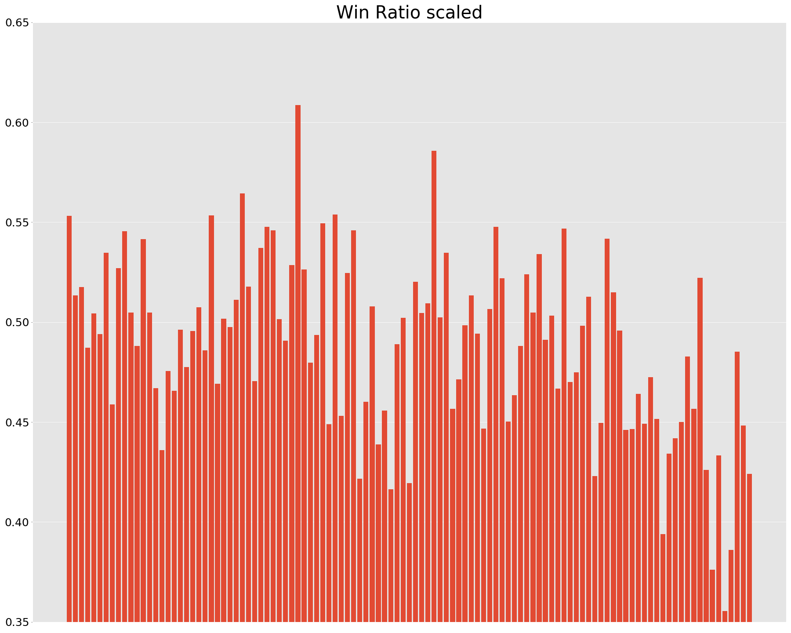
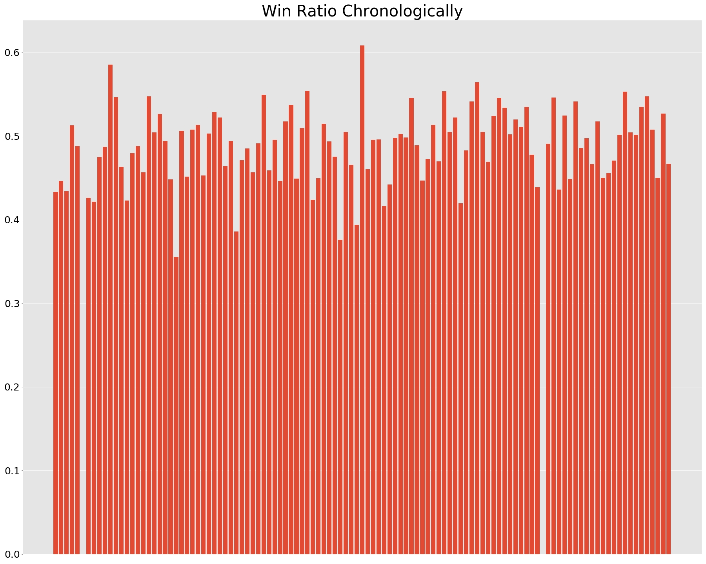
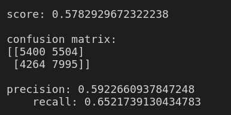
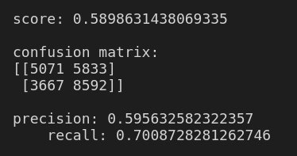
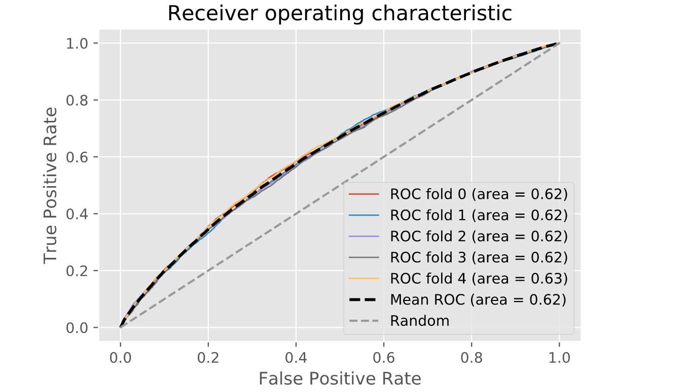

# dota2-win-predictor
Project to build a algorithm that takes in a list of champions picked by two teams and predict the winner

### Richard Bellamy

## Table of Contents

[Data](#Citations)

[Findings](#Findings)

[Model](#Model)

[Goals](#Goals)

## Overview

Dota2 is a computer game played by 2 teams of 5 in direct competition.  Games begin with players selecting the hero they will play for the duration of the game.

The data that I acquired from [UCI Machine Learning](https://archive.ics.uci.edu/ml/datasets/Dota2+Games+Results) came with 2 CSV files totaling 102944 rows.  In this data each row/ observation is representative of a game that was played during a 2 hour span on the 13th of August 2016.

## Findings

Here we have the 5 winningest heros and how wining they are:
('Omniknight', 0.6085336538461539),
 ('Elder Titan', 0.5856687363651619),
 ('Necrophos', 0.564451486625035),
 ('Spectre', 0.5538744901986581),
 ('Skeleton King', 0.5534763948497854)

And here are the ones with the lowest win rate:
("Nature's Prophet", 0.4164259182831201),
 ('Queen of Pain', 0.41954726215968186),
 ('Windranger', 0.43584605817729566),
 ('Lina', 0.43872113676731794),
 ('Leshrac', 0.44195751138088013)
 

So I've established that there is some difference between heros win rates, now letts look at some raw data:

## Model

Because of the way my data came to me it imediatly looked like a good candidate to try a Random Forrest classifier on.  This is the confusion amtrix for the stock sklearn RandomForestClassifier 

`RandomForestClassifier(bootstrap=True, class_weight=None, criterion='gini', max_depth=None, max_features='sqrt', max_leaf_nodes=None, min_impurity_decrease=0.0, min_impurity_split=None, min_samples_leaf=4, min_samples_split=2, min_weight_fraction_leaf=0.0, n_estimators=300, n_jobs=None, oob_score=False, random_state=1, verbose=0, warm_start=False)`

## Goals

- XGBoost got away from me but I want to get after it
- More feature engineering 
- interface where you can pick team and get predictions
- updated data from api and add soft classification

### Citations/ Acknowledgements/ Refrences

#### Main data
Used the data found [here](https://archive.ics.uci.edu/ml/datasets/Dota2+Games+Results)

Dua, D. and Graff, C. (2019). UCI Machine Learning Repository [http://archive.ics.uci.edu/ml]. Irvine, CA: University of California, School of Information and Computer Science. 

#### Hero Release Schedule

https://dota2.gamepedia.com/Heroes_by_release

#### Mode

https://github.com/odota/dotaconstants/blob/master/json/game_mode.json 

#### Type 

https://github.com/odota/dotaconstants/blob/master/json/lobby_type.json

